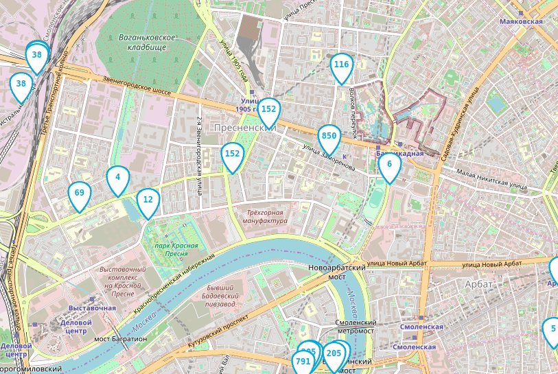

# Автобусы онлайн

Веб-приложение показывает передвижение автобусов на карте Москвы.

## Гифка



## Как это работает

Приложение состоит их трех сервисов:
- веб-интерфейс
- вебсокет-сервер
- эмулятор данных о координатах автобусов

Веб-интерфейс присоединяется к бекэнду по вебсокету, отправляет в него
данные о текущих границах карты, получает данные об автобусах, попадающих
в эти границы.

Эмулятор также отправляет данные в бекэнд через веб-сокеты.

## Как запустить

Приложение запускается в docker-compose, веб-интерфейс доступен по адресу
http://127.0.0.1:3000/

```bash
make run
make stop
```

Можно запустить сервисы прямо на хосте, но вы не хотите этого делать

```bash
cd bus-tracker-backend
poetry install
poetry run emulator --help  # посмотреть какие крутилки есть у сервисов
poetry run bus-tracker --help
poetry run emulator  # можно запустить этот процесс в бекграунде
                     # с помощью 2>&1 & или использовать два терминала
poetry run bus-tracker
```

Чтобы получить веб-интерфейс можно просто открыть html файл в браузере,
он лежит в папке `bus-tracker-frontend/static`

## Цели проекта

Код написан в учебных целях — это урок в курсе по Python
и веб-разработке на сайте [Devman](https://dvmn.org).
